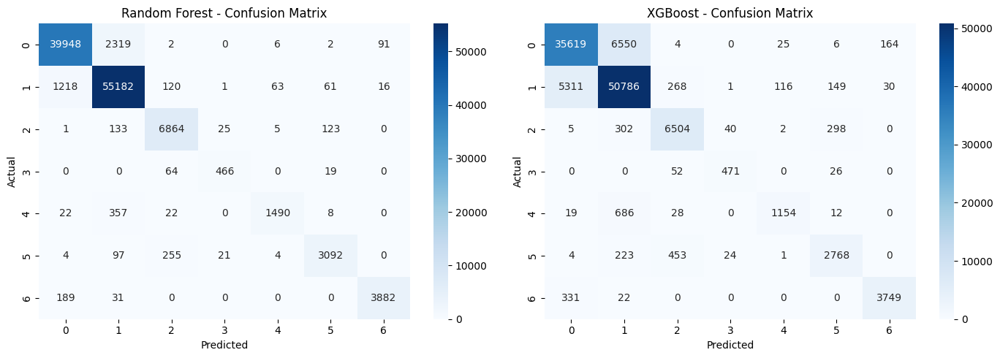
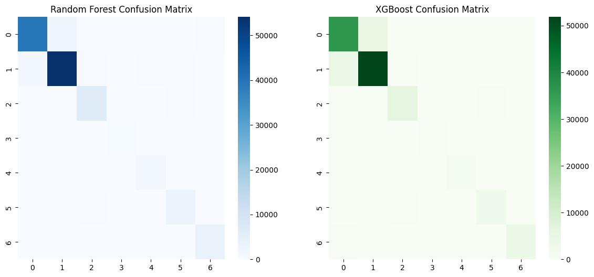
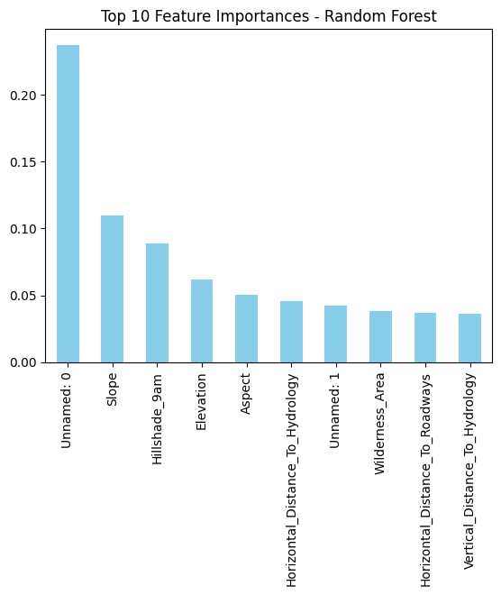
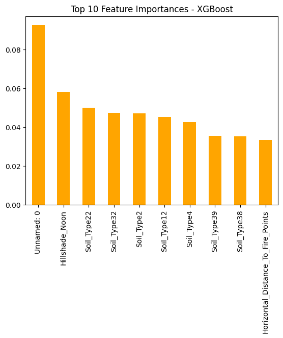

# 🌲 Forest Cover Type Classification

## Overview
Predicting the **forest cover type** from cartographic & environmental features using **tree-based models**.  
We ran solid **EDA**, handled **class imbalance**, trained **Random Forest** and **XGBoost**, and performed **Hyperparameter Tuning**.  
✅ Bonus completed: **model comparison** + **tuning** + visuals (confusion matrices & feature importance).

---

## Dataset
- **Source:** Kaggle — Covertype: Forest Cover Types  
  https://www.kaggle.com/datasets/zsinghrahulk/covertype-forest-cover-types
- **Samples:** ~581k | **Features:** 54 | **Target:** `Cover_Type` (7 classes)

---

## 🛠 Workflow

### 1) EDA
- Checked shape, dtypes, missing values (none).
- **Class imbalance** observed (Classes 1 & 2 dominate).
- Distribution plots & correlations for numeric features.

### 2) Preprocessing
- Remapped `Cover_Type` **1–7 → 0–6** (for scikit-learn/XGBoost).
- One-hot encoded categorical groups (`Wilderness_Area`, `Soil_Type`) if needed.
- `train_test_split` with **stratify** to preserve class ratios.

### 3) Baseline Modeling (Tree-based)
- **Random Forest** with `class_weight="balanced"`.
- **XGBoost** (default-ish settings compatible with multiclass).
- Metrics: **Accuracy**, **Precision/Recall/F1 (macro)**, **Confusion Matrix**.

### 4) Hyperparameter Tuning (Bonus)
- **RandomizedSearchCV** on **30% sample** (speed-up), then retrained best models on full train.
- **Random Forest** tuned: `n_estimators`, `max_depth`, `min_samples_split`, `min_samples_leaf`, `max_features`.
- **XGBoost** tuned: `n_estimators`, `max_depth`, `learning_rate`, `subsample`, `colsample_bytree`.
- Best params (from our run):
  - **RF:** `{'n_estimators': 100, 'min_samples_split': 10, 'min_samples_leaf': 2, 'max_features': 'sqrt', 'max_depth': None}`
    - Best CV Acc (sampled): **0.8894**
  - **XGB:** `{'subsample': 1.0, 'n_estimators': 300, 'max_depth': 7, 'learning_rate': 0.1, 'colsample_bytree': 1.0}`
    - Best CV Acc (sampled): **0.8791**

---

## Results

### 🔵 Before Hyperparameter Tuning
| Model         | Accuracy | Macro Precision | Macro Recall | Macro F1 |
|---------------|----------|-----------------|--------------|----------|
| Random Forest | **0.9546** | **0.95**        | 0.91         | 0.92     |
| XGBoost       | 0.8696   | 0.88            | 0.83         | 0.85     |

### 🟢 After Hyperparameter Tuning
| Model         | Accuracy  | Macro Precision | Macro Recall | Macro F1 |
|---------------|-----------|-----------------|--------------|----------|
| Random Forest | 0.9451    | 0.90            | **0.93**     | 0.91     |
| XGBoost       | **0.8919**| **0.90**        | 0.86         | **0.88** |

**Notes:**
- **Random Forest** stays the overall leader, but…
- **Why RF accuracy dipped slightly after tuning?** We favored **generalization & class balance** (especially improving minority-class recall) over squeezing max raw accuracy—i.e., **less overfitting, more balanced performance**.
- **XGBoost** improved notably (~**+2.2%** Acc), especially helping minority classes.

---

## 📈 Visualizations
Below are some of the visual outputs generated in this project:
1. **Class Distribution Plot** – showing imbalance in target variable  
2. **Confusion Matrices** – before and after tuning for both models  
3. **Feature Importance Plots** – identifying the top environmental and cartographic features contributing to predictions  
4. **Decision Tree Visualization** – for better interpretability of model decisions  

*(Example images here)*  
  
  
  
 

## Tools & Libraries
- Python (Pandas, NumPy, Matplotlib, Seaborn)
- Scikit-learn
- XGBoost
---

